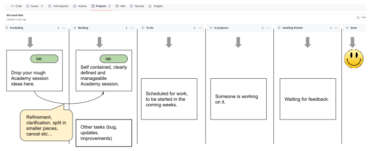

# How to contribute

## Project management
Tasks are tracked via the github `Project`, this direct link should work: https://github.com/lijcam/Instruqt/projects/1

From here, you can self-contribute in the following ways:

* dump your rough lab ideas in the "incubating" column. Make sure you create a github issue, or convert it to an issue. Add the `lab` label. 
* refine existing incubating idea into a well defined lab.
* Add fixes / improvements in the backlog
* Pick up existing tasks from the Todo column, and work on them.
* Add comments on existing tasks.

We plan to run regular meetings (fortnightly) with a focus on transitioning Academy sessions (Labs) ideas from Incubating to the backlog, and to prioretize tasks to transition from the backlog to the todo.
We plan to have a dedicated google chat channel once online discussions start to pick up.

## The Instruqt platform

You will need an instruqt account. Contact Natale V. to gain access to the redhat account

The instruqt **documentation** is reasonably good and short. It's worth spending 1h going through it. The Instruqt **slack** channel is active / monitored by Instruqt time. It's a good way to get some tips, ask for help etc... Instruqt staff normally work in european timezone.

