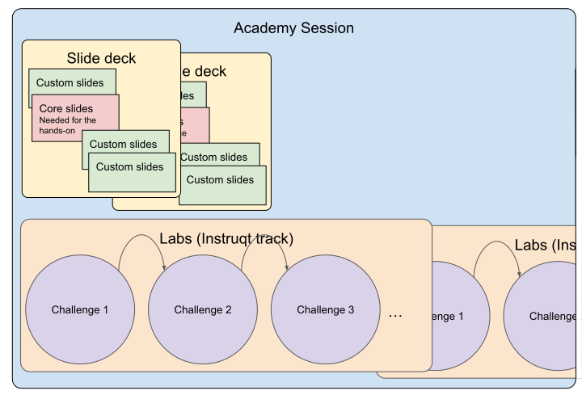

# Academy Session - Bite sized labs

## What
Academy sessions are short ~1h pre-packaged training sessions aimed at enabling customers into solving one of their current of future problem, using OpenShift. Academy sessions are teasers, meant to increase customer interest into doing additional research or POCs.

## Why?
https://drive.google.com/drive/folders/10jZJ3ul4AdaAtvI4Ic3m0VB13GbPiHn0
KSS recording: https://drive.google.com/file/d/18M1wcrSdE_tTDvz1TM1-EbycL0ewSryu/view

## Format
* Enablement sessions
* No marketing
* Use case centered, not feature focused
* Slide deck + hands-on.
* Hands-on available offline, for a limited time, if needed
* Suggested timeframe: delivered in 55 minutes with:
  * 10 min presentations
  * 15 min guided hands-on lab
  * 05 min reflection/questions
  * 15 min guided hands-on lab
  * 05 min reflection/questions
  * 05 min wrap up
* Labs based on Instruqt platform

Hands on lab, delivered via Instruqt, is the key re-usable component that will require some extra attentions. Slide deck 

## Structure
Usually, one deck, and one Lab (containing multiple challenges). Can be adapted as needed.

## Assets
* **Instruqt labs** A hands-on experience. This is a key asset that will be re-usable as is by anyone. It shouldn't need to be customized, effort should be made to keep those labs generic.
* **Slide decks** lives in subdirectories of `Academy Library` shared gfolder. It is understood that decks will be copied / customized according to the audience, trainer preferences, partner involvement, and delivery format. New decks should be shared, and should live in this gdrive (sub)folders.
* The catalog of labs lives in spreadsheet under `Academy Library` shared gfolder, `Catalogue`

## Limitations:
* Current Instruqt code limits us to one Code Ready Container (crc) vm. We will need to inprove current scripts for more advanced use cases.
* Infrastructure on google cloud platform in Europe (slight latency). We will need to use our own cloud account, in APAC region, to overcome that.