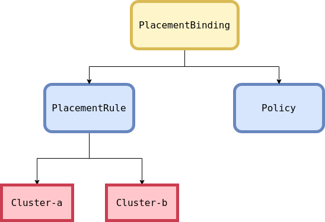
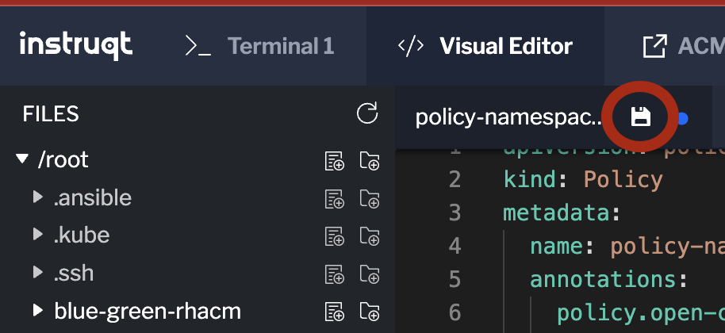

Download the first policy for namespace Creation

```
curl -s https://raw.githubusercontent.com/stolostron/policy-collection/main/stable/CM-Configuration-Management/policy-namespace.yaml -o policy-namespace.yaml
```

The **PlacementRule** are required to deploy Applications on target Clusters as seen below:



Modify the Policy policy-namespace.yaml in the "Visual Editor".

Change the "***remediationAction***" to enforce
```
spec:
  remediationAction: enforce
  disabled: false
  policy-templates:
    - objectDefinition:
        apiVersion: policy.open-cluster-management.io/v1
        kind: ConfigurationPolicy
        metadata:
          name: policy-namespace-example
        spec:
          remediationAction: enforce # the policy-template spec.remediationAction is overridden by the preceding parameter value for spec.remediationAction.
          severity: low
          object-templates:
            - complianceType: musthave
              objectDefinition:
                kind: Namespace # must have namespace 'prod'
                apiVersion: v1
                metadata:
                  name: prod
```

and environment to "***prod***"
```
---
apiVersion: apps.open-cluster-management.io/v1
kind: PlacementRule
metadata:
  name: placement-policy-namespace
spec:
  clusterConditions:
  - status: "True"
    type: ManagedClusterConditionAvailable
  clusterSelector:
    matchExpressions:
      - {key: environment, operator: In, values: ["prod"]}
```

Review and Ensure the saved icon is clicked once edited as shown here



Connect to ACM Hub again:
```
oc login -u admin -p admin https://api.crc.testing:6443 --insecure-skip-tls-verify=true
```

Apply the Policy in the default namespace
```
oc apply -f policy-namespace.yaml -n default
```


Verify the Policy has worked against Spoke1
```
export CLUSTER_NAME=spoke1
```
```
oc login --token=superSecur3T0ken --server=http://${CLUSTER_NAME}:8001
```

Display the newly created namespace
```
kubectl get namespaces
```

Verify the Policy has worked against Spoke2
```
export CLUSTER_NAME=spoke2
```
```
oc login --token=superSecur3T0ken --server=http://${CLUSTER_NAME}:8001
```
Display the newly created namespace
```
kubectl get namespaces
```

# Next Download the second policy

```
curl -s https://raw.githubusercontent.com/stolostron/policy-collection/main/stable/CM-Configuration-Management/policy-pod.yaml -o policy-pod.yaml
```
Modify the Policy ***policy-pod.yaml*** in the "Visual Editor".

Add the new "***namespace: prod***" value created in the previous step

```
          object-templates:
            - complianceType: musthave
              objectDefinition:
                apiVersion: v1
                kind: Pod # nginx pod must exist
                metadata:
                  name: sample-nginx-pod
                  namespace: prod
                spec:
                  containers:
                  - image: nginx:1.18.0
                    name: nginx
                    ports:
                    - containerPort: 80
```

Next, change the Placement rule again to "***prod***" to allow this to propagate to the Prod Clusters as before

```
---
apiVersion: apps.open-cluster-management.io/v1
kind: PlacementRule
metadata:
  name: placement-policy-pod
spec:
  clusterConditions:
  - status: "True"
    type: ManagedClusterConditionAvailable
  clusterSelector:
    matchExpressions:
      - {key: environment, operator: In, values: ["prod"]}
```

Finally update the "***remediationAction***" to enfore.
```
  remediationAction: enforce
  disabled: false
  policy-templates:
    - objectDefinition:
        apiVersion: policy.open-cluster-management.io/v1
        kind: ConfigurationPolicy
        metadata:
          name: policy-pod-example
        spec:
          remediationAction: enforce # the policy-template spec.remediationAction is overridden by the preceding parameter value for spec.remediationAction.
          severity: low
          namespaceSelector:
            include: ["default"]
          object-templates:
            - complianceType: musthave
              objectDefinition:
                apiVersion: v1
                kind: Pod # nginx pod must exist
                metadata:
                  name: sample-nginx-pod
                  namespace: prod
                spec:
                  containers:
                  - image: nginx:1.18.0
                    name: nginx
                    ports:
                    - containerPort: 80
```
Review and Ensure the saved icon is clicked once edited as shown here


Connect to ACM Hub:
```
oc login -u admin -p admin https://api.crc.testing:6443 --insecure-skip-tls-verify=true
```

Apply the Policy in the default namespace
```
oc apply -f policy-pod.yaml -n default
```

Validate the new pods are running in the correct namespace on Spoke1
```
export CLUSTER_NAME=spoke1
```
```
oc login --token=superSecur3T0ken --server=http://${CLUSTER_NAME}:8001
```

Display the newly pods in the prod namespace
```
kubectl get pods -n prod
```

Validate the new pods are running in the correct namespace on Spoke2
```
export CLUSTER_NAME=spoke2
```
```
oc login --token=superSecur3T0ken --server=http://${CLUSTER_NAME}:8001
```
Display the newly pods in the prod namespace
```
kubectl get pods -n prod
```

Note, both **oc** and **kubectl** commands can be used interchangeably

Completed, move onto the next assignment.