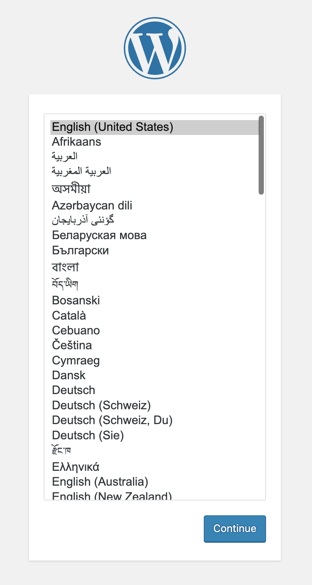

Connect to ACM Hub:

```
oc login -u admin -p admin https://api.crc.testing:6443 --insecure-skip-tls-verify=true
```

### Prerequisites

Some of the policies presented in the repository apply on the wordpress application. In order to deploy the application, run the next command on the hub cluster.

```
curl -s https://raw.githubusercontent.com/waynedovey/instruqt-advanced-cluster-management/main/06-step6/content/application.yml -o application.yml
```
```
oc apply -f application.yml
```

The policies in this repository are deployed in the rhacm-policies namespace. Deploying the namespace can be done by running the next command on the hub cluster.

```
curl -s https://raw.githubusercontent.com/waynedovey/instruqt-advanced-cluster-management/main/06-step6/content/namespace.yml -o namespace.yml
```
```
oc apply -f namespace.yml
```

The policies in this repository are using a PlacementRule resource that maps policies to managed clusters with the 'prod' tag assigned to them. In order to deploy the PlacementRule resource, run the next command on the hub cluster.

```
curl -s https://raw.githubusercontent.com/waynedovey/instruqt-advanced-cluster-management/main/06-step6/content/placementrule.yml -o placementrule.yml
```
```
oc apply -f placementrule.yml
```

In this section we will start enforcing a range of Policies. This is to ensure we have a locked down namespace.
These can be namespace or clusterwide:


Display the newly pods in the prod namespace on spoke1

```
export CLUSTER_NAME=spoke1
```
```
oc login --token=superSecur3T0ken --server=http://${CLUSTER_NAME}:8001
```

Display the new pods in the wordpress namespace
```
oc get pods -n wordpress
```

Display

```
export CLUSTER_NAME=spoke2
```
```
oc login --token=superSecur3T0ken --server=http://${CLUSTER_NAME}:8001
```

Display the new pods in the wordpress namespace
```
oc get pods -n wordpress
```

Success, Review the working Wordpress site with MySQL backend.

Review Tab Spoke1 Wordpress and Spoke2 Wordpress



Congrats! You have completed the Assignments.
