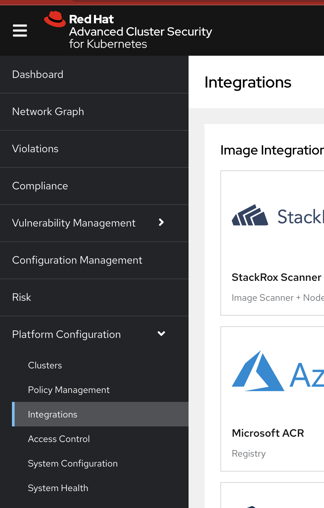
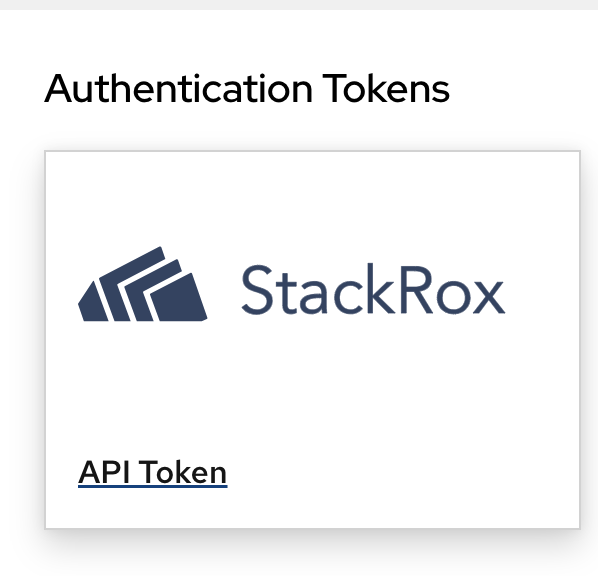
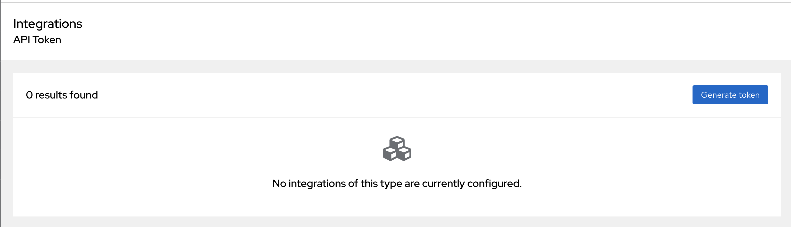
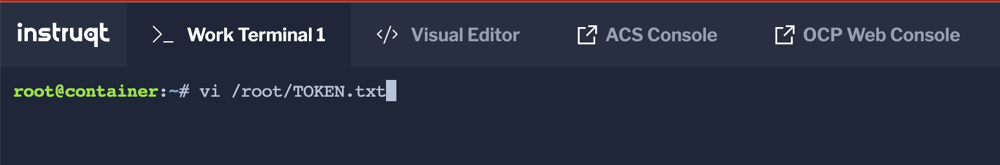
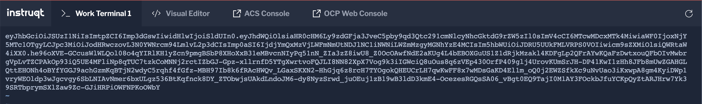
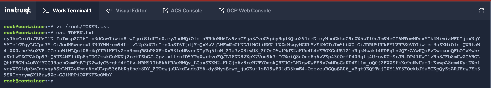
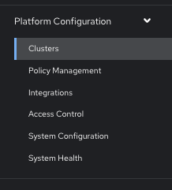
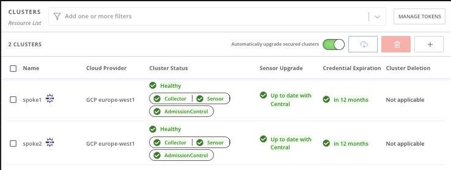

Login to the RHACS Console with

admin/admin


Go to "Platform Configuration" in the Menu, then select "Integrations"



Next, scroll to the bottom of "Integrations" and look for "Authentication Tokens"

Click on the "API Token" Box



On the right select "Generate token"



Now Create the Token with the appropriate name and select the "Admin" Role and select "Generate"


Copy the Token as seen in this Example and create a /root/TOKEN.txt file

Use either the "Work Terminal 1" or the "Visual Editor" and save the file





Next, Login to the RHACS Cluster

```
oc login -u admin -p admin https://api.crc.testing:6443 --insecure-skip-tls-verify=true
```

Export the RHACS Central Route

```
ROX_CENTRAL_ADDRESS=$(oc get route -n acs | awk '{print $2}' | grep -v HOST | head -n 1)
```

Get the Roxctl Binary

```
curl https://raw.githubusercontent.com/waynedovey/rh-advanced-cluster-security/main/assets/roxctl -o /usr/local/bin/roxctl
```
```
chmod a+x /usr/local/bin/roxctl
```

Start the management of Spoke1

```
export CLUSTER_NAME=spoke1
```

Enable the RHACS Helm Charts

```
helm repo add rhacs https://mirror.openshift.com/pub/rhacs/charts/
```

Create the Init Bundle for Spoke1

```
roxctl -e "$ROX_CENTRAL_ADDRESS:443" --token-file=TOKEN.txt central init-bundles generate ${CLUSTER_NAME} --output ${CLUSTER_NAME}_init_bundle.yaml --insecure-skip-tls-verify=true
```

Login to the Spoke1 cluster

```
oc login --token=superSecur3T0ken --server=http://${CLUSTER_NAME}:8001
```

Install the RHACS service on Spoke1

```
helm install -n stackrox --create-namespace stackrox-secured-cluster-services rhacs/secured-cluster-services -f ${CLUSTER_NAME}_init_bundle.yaml --set clusterName=$CLUSTER_NAME --set centralEndpoint=$ROX_CENTRAL_ADDRESS:443 --set imagePullSecrets.allowNone=true --set env.offlineMode=true --set image.registry=quay.io/wdovey/advanced-cluster-security
```

Show the installed Pods
```
oc get pods -n stackrox
```

Start the management of Spoke2

```
export CLUSTER_NAME=spoke2
```

Create the Init Bundle for Spoke2

```
roxctl -e "$ROX_CENTRAL_ADDRESS:443" --token-file=TOKEN.txt central init-bundles generate ${CLUSTER_NAME} --output ${CLUSTER_NAME}_init_bundle.yaml --insecure-skip-tls-verify=true
```

Login to the Spoke2 cluster

```
oc login --token=superSecur3T0ken --server=http://${CLUSTER_NAME}:8001
```

Install the RHACS service on Spoke2

```
helm install -n stackrox --create-namespace stackrox-secured-cluster-services rhacs/secured-cluster-services -f ${CLUSTER_NAME}_init_bundle.yaml --set clusterName=$CLUSTER_NAME --set centralEndpoint=$ROX_CENTRAL_ADDRESS:443 --set imagePullSecrets.allowNone=true --set env.offlineMode=true --set image.registry=quay.io/wdovey/advanced-cluster-security
```

Show the installed Pods
```
oc get pods -n stackrox
```

Now review the fully mananged Kuberentes Clusters with RHACS on the RHACS Console

Go to "Platform Configuration" in the Menu, then select "Clusters"



You should now see both clusters Healthy and fully imported with all Green Ticks



Completed, move onto the next assignment.
