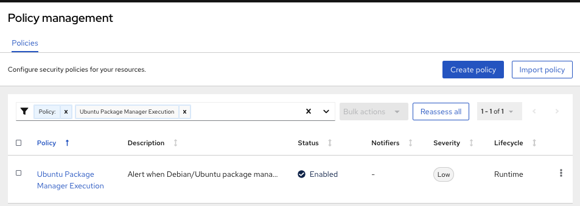
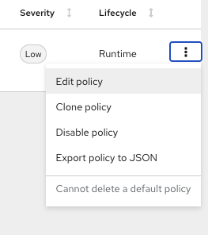
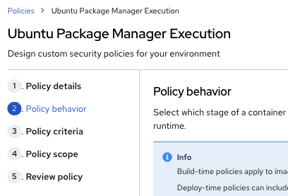
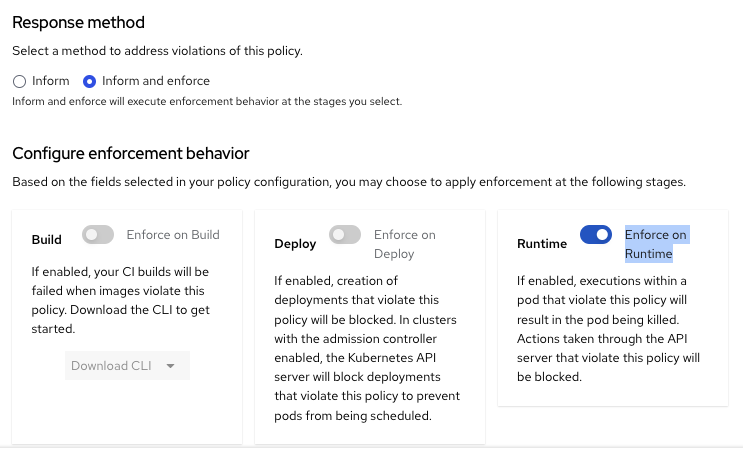

Login to the RHACS Console


Next, set the policy to enforce.

Go to "Platform Configuration" in the Menu, then select "Policy management"

Search for "Ubuntu Package Manager Execution"



Next, select "Edit policy"



Similar to the previous assigment, select the "Policy behavior"



Then go down to the "Response method" and enable "Inform and enforce"

This time choose the "Enforce on Runtime" option



Now click on the "Next" 3 times and then "Save" this policy

Next, deploy the same Pod/Application in a new namespace in the "Work" Shell

Start the management of Spoke1
```
export CLUSTER_NAME=spoke1
```

Login to the Spoke1 cluster
```
oc login --token=superSecur3T0ken --server=http://${CLUSTER_NAME}:8001
```

Create the namespace

```
kubectl create namespace test-runtime
```

Test the Pod/Application on the Spoke1 cluster

```
oc run tmp-shell -n test-runtime --labels="app=tmp-shell" --rm -i --tty --image ubuntu:18.04 -- apt update
```

You should see the error message similar to this:

<div style="background-color: #000A4F">
<br>
Error attaching, falling back to logs: pods "tmp-shell" not found
No resources found
Error from server (NotFound): pods "tmp-shell" not found
<br>
<br>
</div>

Verify that RHACS has enforced the policy

```
kubectl get events -n test-runtime | grep -i StackRox
```

You should see the error message similar to this:

<div style="background-color: #000A4F">
<br>
06s        Warning   StackRox enforcement   pod/tmp-shell   A pod (tmp-shell) violated StackRox policy "Ubuntu Package Manager Execution" and was killed
<br>
<br>
</div>

Cleanup the namespaces

```
kubectl delete ns ssh-test ssh-test-enforce test-runtime
```

Completed, move onto the next assignment.