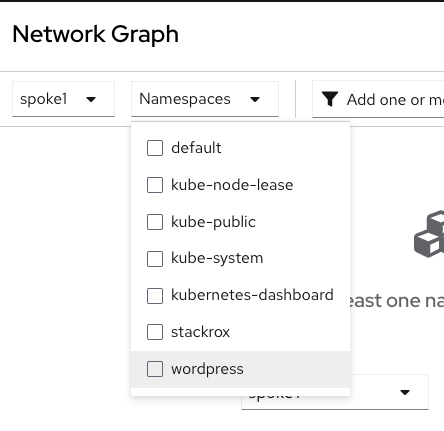

Login to the Spoke1 Cluster
```
export CLUSTER_NAME=spoke1
```

Login to the Spoke1 cluster
```
oc login --token=superSecur3T0ken --server=http://${CLUSTER_NAME}:8001
```

Ensure the namespaces have been removed (Ignore any errors)

```
kubectl delete ns ssh-test ssh-test-enforce test-runtime
```

Add the required Helm Repo

```
helm repo add bitnami https://charts.bitnami.com/bitnami
```

Update to the latest

```
helm repo update
```

Create the required Namespace for Wordpress
```
kubectl create namespace wordpress
```

Now install the Wordpress sample application and pay attention to the Nodeport for Console access
```
helm install wp-test bitnami/wordpress -n wordpress --set service.nodePorts.http=31500
```

Check the running App
```
oc get pods -n wordpress
```

Once both pods "STATUS" is set to Runnin, you can now browse to the "Wordpress" Link


Check for any current NetworkPolicies on the namespace
```
oc get NetworkPolicy -n wordpress
```

Login to the RHACS Console


Navigate to the "Network Graph" link on the Console

Ensure the "spoke1" cluster is selected and "wordpress" under "Namespaces"



Click on the "wp-test-mariadb" Deployment and review the various Ports and Protocols


Now Click on the "Network Policies" Tab and observe "No network policies define for this deployment"


Next, Click on the "Network Policy Simulator" on the top Right


Then click on the "Generate and simulate network policies" Tab


This will output a message "Successfully generated YAML" and the appropriate NetworkPolicy file


Now Select the "Apply Network Policies" button, confirm and "APPLY"


This will output a message "Successfully applied YAML"


Return to the "Work" Screen and check the NetworkPolicy and Describe them

```
oc get NetworkPolicy -n wordpress
```

```
oc describe NetworkPolicy stackrox-generated-wp-test-mariadb -n wordpress
```

This will show the appropriate ports that are allowed.

You can also test the "Wordpress" URL again.

Completed, move onto the next assignment.