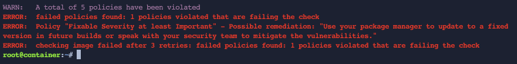
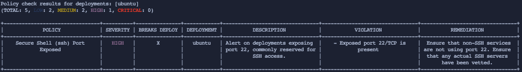
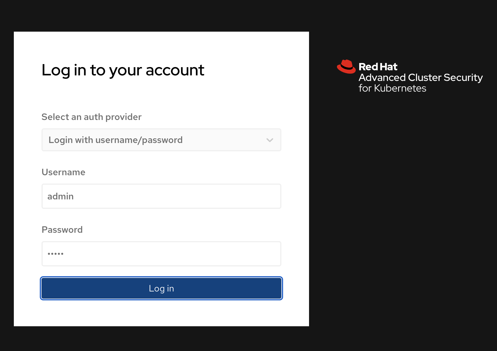
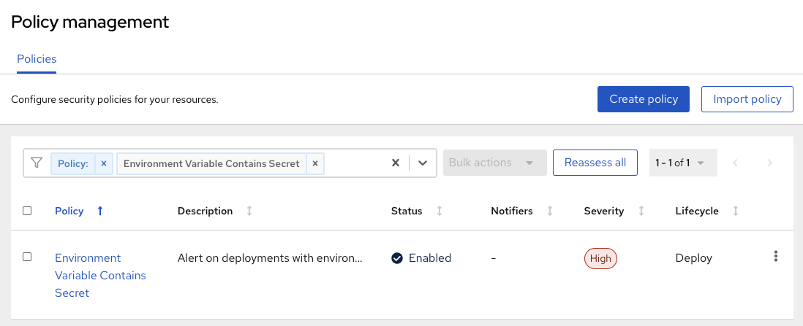
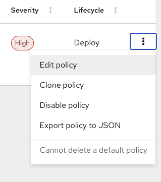
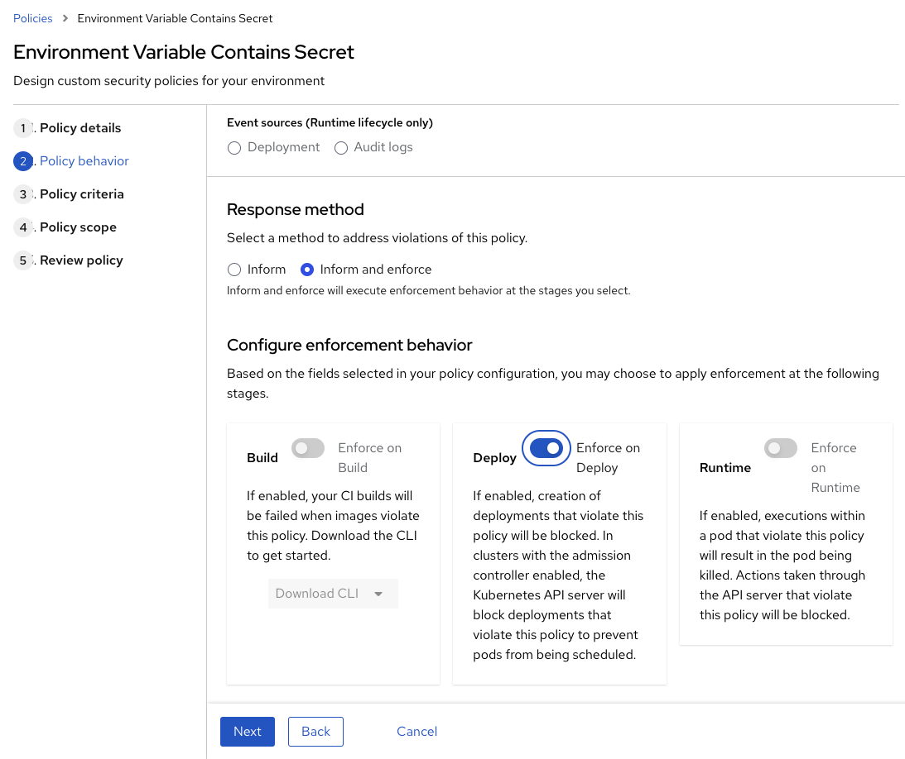
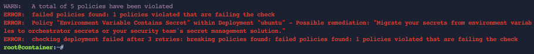

Ensure the Roxctl Command Line Tool is available

```
roxctl version
```

Login to the RHACS Cluster

```
oc login -u admin -p admin https://api.crc.testing:6443 --insecure-skip-tls-verify=true
```

Export the RHACS Central Route

```
ROX_CENTRAL_ADDRESS=$(oc get route -n acs | awk '{print $2}' | grep -v HOST | head -n 1)
```

First we are going to check image Vulnerabilities

```
roxctl -e "$ROX_CENTRAL_ADDRESS:443" --token-file=TOKEN.txt image check --image docker.io/vulnerables/cve-2017-7494 --insecure-skip-tls-verify=true
```

This will produce a report and give details on the image as well as the Pass or Fail as seen in this example below:



Check the return code for the command, 1 indicates a failure.

```
echo $?
```

Incorporated into a CI/CD build pipeline, this failure code will stop the pipeline, and leave the policy violation output in the build job console.

<br>
<br>
Next, we will use the Roxctl Command Line Tool to validate syntax of Kubernetes Artifacts

Create a Service Artifacts
```
cat <<EOF > check-syntax-service.yaml
apiVersion: v1
kind: Service
metadata:
  name: ubuntu-lb
  labels:
    app: ubuntu
spec:
  ports:
    - port: 22
  selector:
    app: ubuntu
  type: LoadBalancer
EOF
```

Create a Deployment Artifacts
```
cat <<EOF > check-syntax-deployment.yaml
apiVersion: apps/v1
kind: Deployment
metadata:
  name: ubuntu
  labels:
    app: ubuntu
spec:
  selector:
    matchLabels:
      app: ubuntu
  template:
    metadata:
      labels:
        app: ubuntu
    spec:
      containers:
      - name: ubuntu
        image: ubuntu:18.04
        ports:
        - containerPort: 22
EOF
```

Use the Roxctl Command Line Tool to validate the validate the Service File
```
roxctl -e "$ROX_CENTRAL_ADDRESS:443" --token-file=TOKEN.txt deployment check --file /root/check-syntax-service.yaml --insecure-skip-tls-verify=true
```

Use the Roxctl Command Line Tool to validate the validate the Deployment File
```
roxctl -e "$ROX_CENTRAL_ADDRESS:443" --token-file=TOKEN.txt deployment check --file /root/check-syntax-deployment.yaml --insecure-skip-tls-verify=true
```

The Service file validation should look ok but the Deployment File fails with a "HIGH SEVERITY"

You will also notice there is a Flag on the "BREAKS DEPLOY" output with a "X"



This will prevent this from being deployed to OpenShift or Kubernetes

We will now use the Roxctl Command Line Tool to verify a Deployment File with a plain text password.

Login to the RHACS Console



Next, set the policy to enforce.

Go to "Platform Configuration" in the Menu, then select "Policy management"

Search for "Environment Variable Contains Secret"



Next, select "Edit policy"



Then choose No.2 "Policy behavior" on the left

Looks for "Response method" and change this to "Inform and enforce" and enable "Enforce on Deploy" option



Now click on the "Next" 3 times and then "Save" this policy

Create a Deployment Artifacts
```
cat <<EOF > check-password-deployment.yaml
apiVersion: apps/v1
kind: Deployment
metadata:
  name: ubuntu
  labels:
    app: ubuntu
spec:
  selector:
    matchLabels:
      app: ubuntu
  template:
    metadata:
      labels:
        app: ubuntu
    spec:
      containers:
      - name: ubuntu
        image: ubuntu:18.04
        env:
            - name: AWS_SECRET_ACCESS_KEY
              value: "abcdefg"
EOF
```

Use the Roxctl Command Line Tool to validate the validate the Deployment File
```
roxctl -e "$ROX_CENTRAL_ADDRESS:443" --token-file=TOKEN.txt deployment check --file /root/check-password-deployment.yaml --insecure-skip-tls-verify=true
```

This will now fail and report an error similar to this



Completed, this is the final assignment.