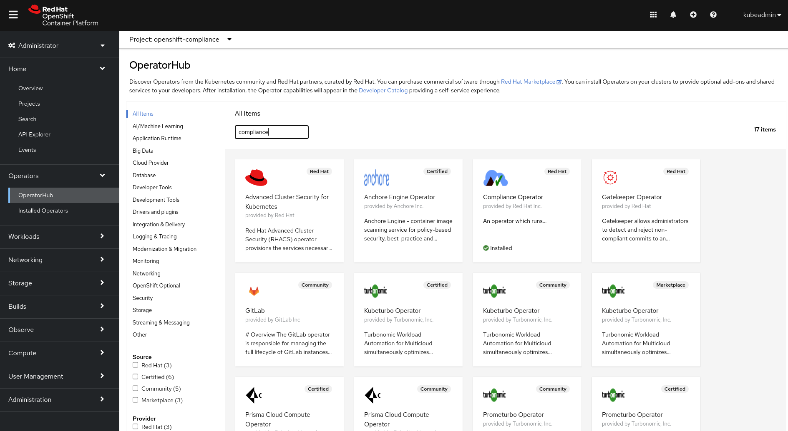
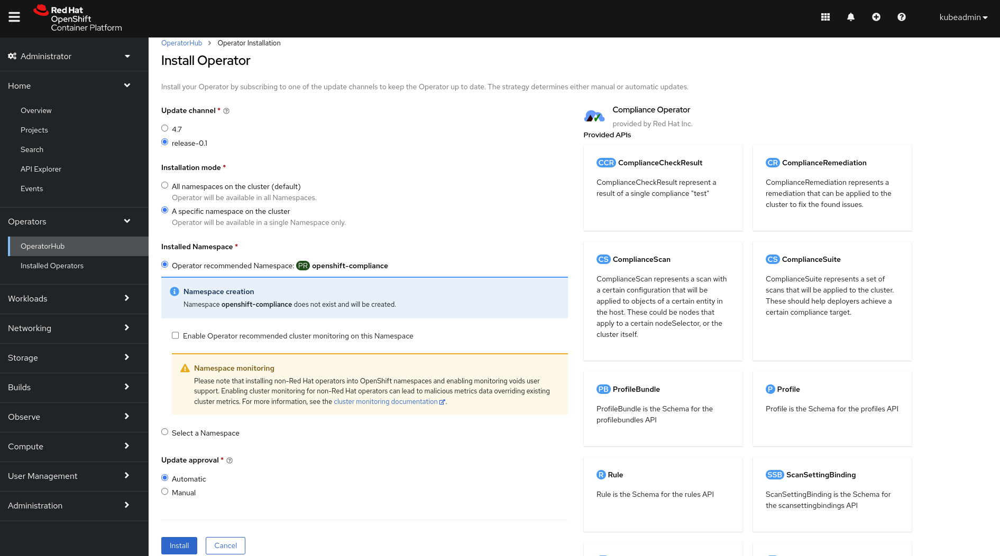

The Compliance Operator available in Red Hat OpenShift Container Platform is exactly designed for this requirement. It helps you to identify compliance and security issues, create reports, and remediate issues in a Kubernetes-native way.

## Install the Compliance Operator

Let's first install the Compliance Operator. It's available from the OperatorHub, a marketplace for Kubernetes Operator available within Red Hat OpenShift.

From the Administrator perspective select the 'Operators' menu item, and then the 'OperatorHub.

Next, enter 'Compliance' in the search bar. This will show you several options, one of which is the 'Compliance Operator provided by Red Hat Inc.' Selecting the compliance operator will give you more information.

Select 'Install' and you'll be shown a number of options for the Compliance Operator installation. For this lab, we'll configure some basic settings:
- Select 'release-0.1' for the Update Channel
- Select 'A Specific namespace on the cluster' for the Installation mode
- Select 'Operator recommended namespace' for the Installed Namespace. This will install the Compliance Operator into the `openshift-compliance` namespace. 
- Select 'Automatic' for the Update approval

Leave the rest of the options unchecked and select 'Install'. 

On the next screen you'll see the Compliance Operator installation progressing.

When the installation completes, this screen will update and allow you to see the installed operator.

## Validate the installation

To validate the installation, select 'Operators' from the left-hand menu and then 'Installed Operators'. Ensure that the `openshift-compliance` namespace is selected from the top menu.

If the installation is successful, you should be able to see that the Compliance Operator is available in the `openshift-compliance` namespace, and that the status of the installation is 'Succeeded'.

