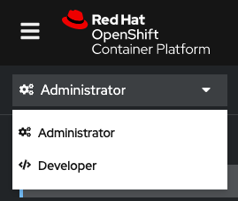
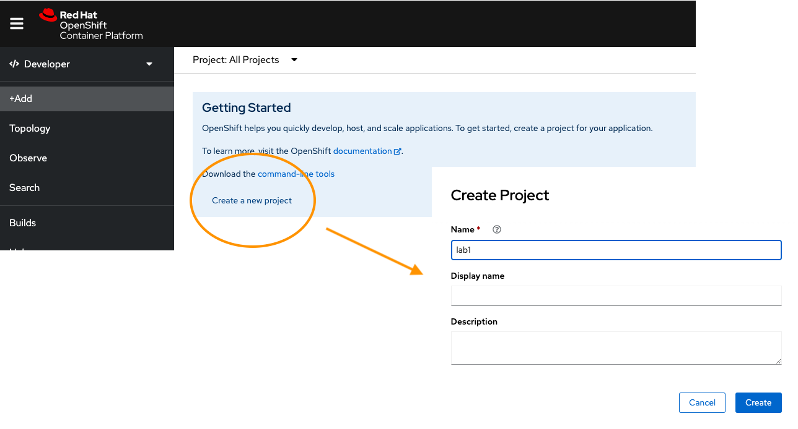
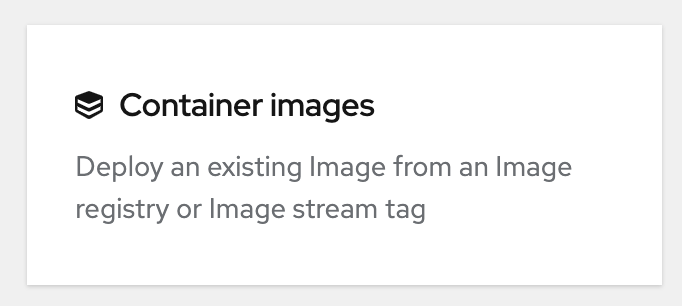
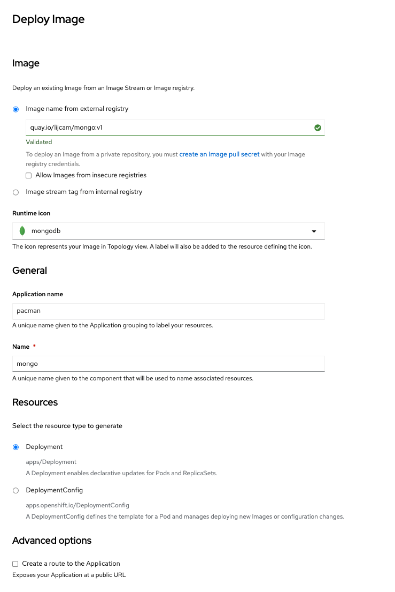

Another email comes through with details of the OpenShift cluster, and location of the container images.
The email also included specifics of how the containers should be deployed.
You now have all the information you need to deploy the Pacman application.

If you're not already logged in, use these credentials.

<pre>
  username: admin
  password: admin
</pre>

When you first log in to OpenShift, you will be in the Administrators. Explore the interface to find the perspective toggle and switch to the Developer perspective.

Can't find it? Here's a hint.

## Create the project

Projects are a way for teams to organise their applications and content in isolation from other teams.

From the Developer perspective create a new project by clicking on `Create a new project`.
Name the project `team-pacman`.

More information on Projects can be found in the [working with projects](https://docs.openshift.com/container-platform/4.10/applications/projects/working-with-projects.html "Red Hat OpenShift documentation") section of the OpenShift documentation.

## Deploy the application

You have a quick check of the OpenShift documentation, only to find that there are [numerous ways](https://docs.openshift.com/container-platform/4.10/applications/creating_applications/odc-creating-applications-using-developer-perspective.html "Red Hat OpenShift documentation") to manage an application in a Kubernetes cluster. But since the development team have provided the location of two container images, we can simply deploy from the image.

Click the `+Add` menu item, followed by `Container images`.

Firstly deploy the Mongo container using the following specification.

| Configuration                        | Parameter                 |
|--------------------------------------|---------------------------|
| Image name from external registry    | `quay.io/lijcam/mongo:v1` |
| Runtime icon                         | mongodb                   |
| Application Name                     | pacman                    |
| Name                                 | mongo                     |
| Select the resource type to generate | Deployment                |
| Create a route to the Application    | untick                    |

Click the `+Add` menu item, followed by `Container images`.

Deploy the Pacman container using these parameters.

| Configuration                        | Parameter                  |
|--------------------------------------|----------------------------|
| Image name from external registry    | `quay.io/lijcam/pacman:v1` |
| Runtime icon                         | nodejs                     |
| Application Name                     | pacman                     |
| Name                                 | pacman                     |
| Select the resource type to generate | Deployment                 |
| Create a route to the Application    | tick                       |

# Verifying our application is available

After completing our deployments, we can return to the topology screen. You will notice that the Pacman container has a small arrow symbol to the right of it. This links to the route of the application. Pressing this will take you to the Pacman application.

