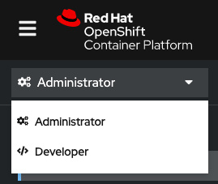

Following on from the previous exercise, we will redeploy the Pacman application using Kubernetes objects.

Kubernetes Objects are persistent entities in the Kubernetes system. Kubernetes uses these entities to represent the state of a cluster. A Kubernetes object is a "record of intent"—once you create the object, Kubernetes will constantly work to ensure that object exists. We use YAML notation to describe Kubernetes Objects, and are the foundation of Infrastructure as Code practices in Kubernetes.

In the previous exercise, OpenShift created our Kubernetes Objects for us, in this exercise will use the Kubernetes Objects created by the team since the last test.
Look in the Editor Tab, we can see objects we will apply.
Click on each of the items and study their composition.

As you can see, there are numerous matching labels across all the objects.
A label is a key-pair value tag that can be applied to most resources in Kubernetes to give extra meaning or context to that resource for later filtering for selecting.
There are several [recommended labels](https://kubernetes.io/docs/concepts/overview/working-with-objects/common-labels/ "Kubernetes.io Recommended Labels") that are used by Kubernetes including Openshift to link objects, and visual the project in the Topology view.

## Deploy the database

Create the Project, Mongo Deployment and Service.

```
oc new-project team-pacman
```

```
cd /root/team-pacman
```

```
oc apply -f mongo-deployment.yml
```

```
oc apply -f mongo-service.yml
```

<details><summary>Review the deployment from the OpenShift Console. Use these credentials.</summary>
<pre>
  username: admin
  password: admin
</pre>
You may need to logout from the OpenShift console from the previous exercise.
</details>

Enter the Developer perspective, and enter the Topology view. Switch to Project `team-pacman`.



## Deploy the Pacman application

Use the existing Pacman Kubernetes Objects to deploy the Pacman app.

```
oc apply -f pacman-deployment.yml
```

```
oc apply -f pacman-service.yml
```

```
oc apply -f pacman-route.yml
```

Return to the OpenShift console to review the Topology.

Once the Pacman application is up and running, we can find its route by running:

```
oc get routes
```
## Using a label selector

When we ran `oc get routes` Kubernetes returns results in the context of the project we are in. We can determine which project context we are in by running.

```
oc project
```

What if we want to see all the routes out of our Kubernetes Cluster? We can include the `-A` flag, this tells Kubernetes to return all results from all projects.

```
oc get -A routes
```

What if we don't know what project something is in? We can use a label selector to find it.

```
oc get -A routes -l app=pacman
```