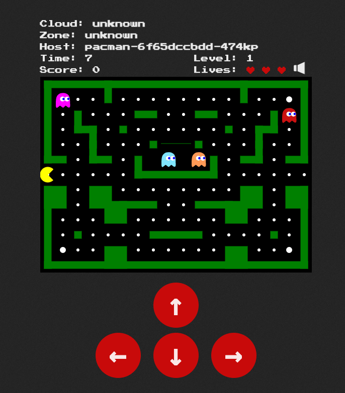

This exercise builds on what we learned from the previous exercise. The goal, to attach storage into our mongo pod to keep our high scores!

If you are looking for more of a challenge, this section has the option to complete using the command line, but does require familiarity with editing [YAML notation](https://en.wikipedia.org/wiki/YAML).

Containers are stateless in nature. If our container fails, is redeployed, or rescheduled to another node, any data it is storing will be lost. In Kubernetes, we use Persistent Volumes to overcome this, by attaching a Persistent Volume Claim to our containers.

<details><summary>Review the deployment from the OpenShift Console. Use these credentials.</summary>
<pre>
  username: admin
  password: admin
</pre>
You may need to log out from the OpenShift console from the previous exercise.
</details>


Enter the Developer perspective, and enter the Topology view. Switch to Project `team-pacman`.


The mongo deployment is not yet using Persistent Volumes, if the mongo pod restarts, our high scores are lost.

Go ahead and try.


1. Play a Pacman game and hit a high score.
2. Click on the mongo deployment and scale it down to zero pods, and back to one.
3. Go back to Pacman and display the high score leaderboard. What did you find?

Let's add some persistence!
## Create your Persistent Volume Claim

### OpenShift Console instructions (recommended)

Skip this section if you want to try to create the Persistent Volume Claim using the command line.

Switch to the `Administrator` perspective if needed, and navigate to `Storage` > `PersistentVolumeClaims` and click on `Create PersistentVolumeClaim`.

| Configuration              | Parameter           |
|----------------------------|---------------------|
| PersistentVolumeClaim name | `mongo-storage`     |
| Access mode<sup>(1)</sup>  | `Single User (RWO)` |
| Size                       | `8 GiB`             |
| Use label selectors...     | `untick`            |
| Volume mode                | `Filesystem`        |

> &#8505;&#65039; You can learn more about access modes (RWO, RWX, ROX)
> [here](https://docs.openshift.com/container-platform/4.10/storage/understanding-persistent-storage.html#pv-access-modes_understanding-persistent-storage).


### OpenShift command line instructions

Skip this section if you created the Persistent Volume Claim using the Openshift Console.

The Persistent Volume Claim Kubernetes object file is already available and ready for you to apply. Review the content of the claim using the Editor Tab.

```
oc apply -f /root/team-pacman/mongo-pvc.yml
```

### Review the Persistent Volume Claim

After creating the Persistent Volume Claim, you should see it in the OpenShift Console from the Administrator perspective: `Storage` > `PersistentVolumeClaims`.
Notice that the capacity displayed is of the Persistent Volume. The Persistent Volume Claim has a requested capacity of 8 GiB.


## Mount the Persistent Volume Claim
### OpenShift Console instructions (recommended)

Skip this section if you want to try mounting the Persistent Volume Claim using the command line.

Switch to the Developer perspective, make sure the current project is `team-pacman`, navigate to Topology, and bring up the details of the mongo deployment.
Select `Actions` then `Add storage`.


The mongo container image expects an external volume mounted in `/bitnami/mongodb` to store data.

Configure the storage as follows:

| Configuration          | Parameter          |
|------------------------|--------------------|
| Use existing claim     | `mongo-storage`    |
| Mount path             | `/bitnami/mongodb` |
| Mount as read-only     | `untick`           |

Click `Save`


Your deployment will automatically redeploy a new mongo pod with the volume attached.

### OpenShift command line instructions

Skip this section if you added storage using the Openshift Console.

Edit the `mongo-deployment.yaml` file in the Editor Tab.

Modify our pod template for mongo to include the `volume`, and a `volumeMount` for the container. [An example can be found in offical documentation](https://docs.openshift.com/container-platform/4.10/storage/understanding-persistent-storage.html#pvc-claims-as-volumes_understanding-persistent-storage) but make sure you set the following parameters correctly.

1. In the container, `volumeMounts` section, the `mountPath` must be `/bitnami/mongodb`
2. In the volume section, `claimName` must match the name of the Persistent Volume Claim, i.e., `mongo-storage`.

Once you have done the required modifications, you can re-apply the mongo Deployment with:

```
oc apply -f /root/pacman-team/mongo-deployment.yaml
```

## Test your changes

Congratulation, you just enabled data persistence. Return to the OpenShift console to access Pacman and set yourself the high score.
Check that even after scaling down the mongo pod, the new one automatically created will mount the PVC and display your high score correctly.


