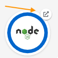

This exercise builds on what we learned from the previous exercise. The goal, to attach storage into our mongo pod to keep our high scores!

In this challenge, you will have the option to run the instructions using the OpenShift console, or use the Command Line Interface (CLI). We recommended
using the OpenShift console set of instructions. The CLI instructions requires you to be comfortable with yaml files, and with working from the shell.

Containers are stateless in nature. If our container fails, is redeployed, or rescheduled to another node, any data it is storing will be lost. In Kubernetes, we use Persistent Volumes to overcome this, by attaching a Persistent Volume Claim to our containers.

The OpenShift project and resources have already been created for you:

- team-pacman project
- mongo deployment
- mongo service
- pacman deployment
- pacman service
- pacman route

If you open the console, you should see all those resources. Make sure to use the `Developer` perspective,
pick the Project `team-pacman` if needed, and look at the `Topology`.


This deployment is not yet using persistent volumes, so your high score won't be safe if the mongo pod get restarted.
Go ahead and try. Remember that one way to open the URL of a route is via the Topology 
1. Play a pacman game and hit a high score.
2. Restart the mongo pod. You might scale down to zero and back to one the mongo Deployment, **or** you can navigate to the pod details
and click on `Action` -> `Delete Pod`, in which case the deployment will automatically recreate a new one.
3. Go back to pacman and display the high score leaderboard. It's all gone.

Now, let's add some persistence!
## Create your Persistent Volume Claim
You can create your PVC using the OpenShift console, or the CLI. Pick and follow **one** of the OpenShift console **or** CLI set of instructions:

### OpenShift console instructions (recommended)

To create this Persistent Volume Claim, we are going to use the console. Start by switching to the `Administrator` perspective if needed,
and navigate to `Storage`->`PersistentVolumeClaims` and click on `Create PersistentVolumeClaim`.

| Configuration              | Parameter           |
|----------------------------|---------------------|
| PersistentVolumeClaim name | `mongo-storage`     |
| Access mode<sup>(1)</sup>  | `Single User (RWO)` |
| Size                       | `8 GiB`             |
| Use label selectors...     | `untick`            |
| Volume mode                | `Filesystem`        |

> &#8505;&#65039; **INFO**: You can learn more about access modes (RWO, RWX, ROX)
> [here](https://docs.openshift.com/container-platform/4.10/storage/understanding-persistent-storage.html#pv-access-modes_understanding-persistent-storage).


### CLI instructions (if you completed the last instructions using the OpenShift console, you should skip this section)
The PersistentVolumeClaim yaml resource file is already available and ready for you to apply. Check it's content, either
via Instruqt editor, or by displaying it from the console with `cat /root/team-pacman/mongo-pvc.yml`. Once you reviewed
the content file, you can apply it with:

```
oc apply -f /root/team-pacman/mongo-pvc.yml
```

### Check you can see your PVC
After creating your PVC, you should see it in the console from the `Administrator` perspective: `Storage` -> `PersistentVolumeClaims`. Note that the Capacity displayed is
the one of the Persistent Volume. The PVC claim has a `Requested capacity` of 8GiB, as can be seen when clicking on the mongo-storage PVC


Next, let's mount this PVC to your mongo deployment

## Mount your PVC.
You can mount your PVC using the OpenShift console, or the CLI. Pick and follow **one** of the OpenShift console **or** CLI set of instructions:

### OpenShift console instructions (recommended)

If needed, switch to the `Developer` perspective, make sure the current project is `team-pacman`, navigate to `Topology`, and display your mongo Deployment.
From here, you should be able to click on the `Actions` dropdown menu and select `Add storage`.


The MongoDB docker image used here expect an external volume mounted in /bitnami/mongodb when persistence is required.
Configure your added storage as follow:

| Configuration          | Parameter          |
|------------------------|--------------------|
| Use existing claim     | `mongo-storage`    |
| Mount path             | `/bitnami/mongodb` |
| Mount as read-only     | `untick`           |

Click `Save`


Your deployment will automatically redeploy a fresh new mongodb pod with this volume attached.

### CLI instructions (if you completed the last instructions using the OpenShift console, you should skip this section)

Your OpenShift mongo deployment was created from the `/root/pacman-team/mongo-deployment.yaml` file.
We are going to modify this file, and update the deployment.

Edit the `/root/pacman-team/mongo-deployment.yaml` file to add a `volume`, and a `volumeMount` for the pod. Check
how this is done from this [example that can be found in offical documentation](https://docs.openshift.com/container-platform/4.9/storage/understanding-persistent-storage.html#pvc-claims-as-volumes_understanding-persistent-storage)
but make sure you set the following parameters correctly:
1. The `claimName` should be the one of the PVC created earlier, which is `mongo-storage`
2. The `mountPath` should be set to `/bitnami/mongodb` as this the location where this mongo container stores it's data.

Once you have done the required modifications, you can  re-apply the mongo Deployment with:

```
oc apply -f /root/pacman-team/mongo-deployment.yaml
```

## Test your changes

Congratulation, you just enabled data persistence! Return to the OpenShift console to access Pacman and set yourself the high score. Check
that even after deleting the mongo pod, the new one automatically created will mount the PVC and display your high
score correctly.


