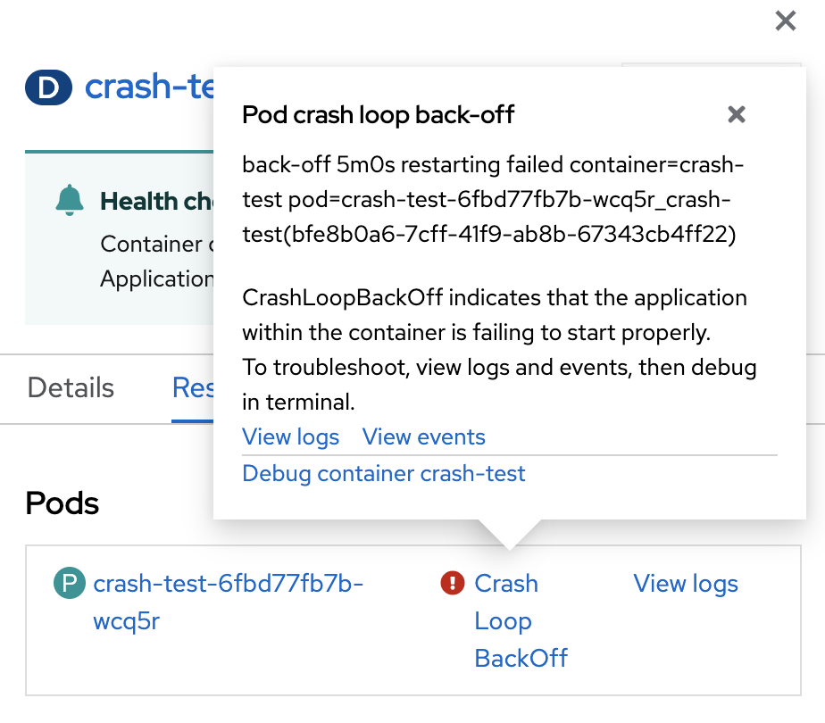

A core skill working with Kubernetes is diagnosing containers crash events.

Complete this exercise using the following credentials:

<pre>
  username: admin
  password: admin
</pre>

Switch to the Developer prespective.

You’ve deployed the latest version of the crash-test application to the cluster, and funnily enough, it is crashing on startup.
Looking at the topology view of the crash-test project, you’ll find the container’s halo transition from blue, yellow, and finally red.
Once red, Kubernetes has put the container in `Crash Loop BackOff` state.

Command line

  <pre>oc get pods</pre>

## Click on the deployment.

Command line

  <pre>oc describe pod <em>pod_name</em></pre>

From OpenShift 4.10 clicking on `Crash Loop BackOff` will reveal more details of the erroneous state and suggested places to start troubleshooting.

Containers can crash for a variety of reasons. Often, applications inside containers stop if they are missing a key piece of configuration needed to run safely.

## Let’s review the logs.

Command line

  <pre>oc logs <em>pod_name</em></pre>

The error message in the logs suggests that the pod is looking for an environment variable.
We can check environment variables by clicking on the Environment tab.

Do you see a `LOG_ECHO` environment variable?

---

## Diagnosis

The deployment is missing the `LOG_ECHO` environment variable.
Return to the topology screen, and the deployment details.

---

## The fix

From the `Actions` menu, click `Edit Deployment`.

Scroll down to the environment variables section and add the `LOG_ECHO` environment variable. Confirm by clicking Save.

Command line

  <pre>oc edit deployment/crash-test</pre>

Once saved, Kubernetes will act upon the updated deployment and reconcile towards the new desired state.

Does the container crash this time?
We can confirm the container is healthy by checking the container logs.

