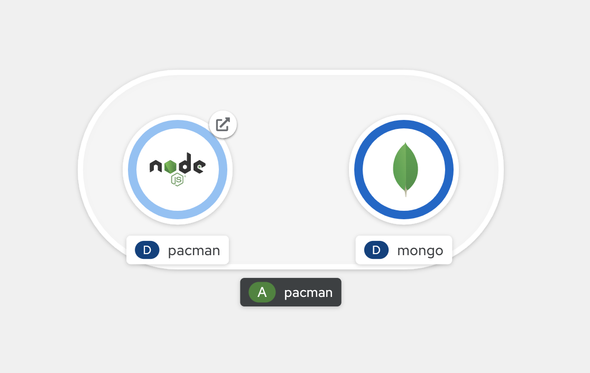
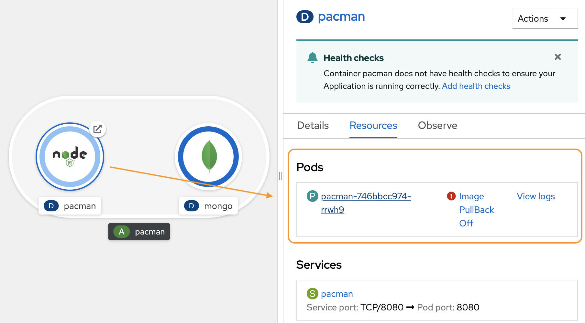
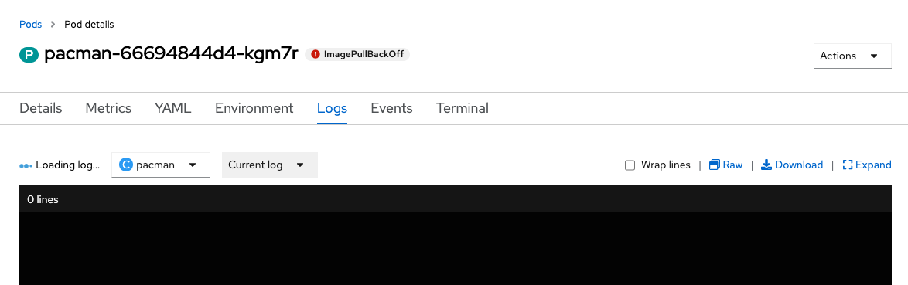
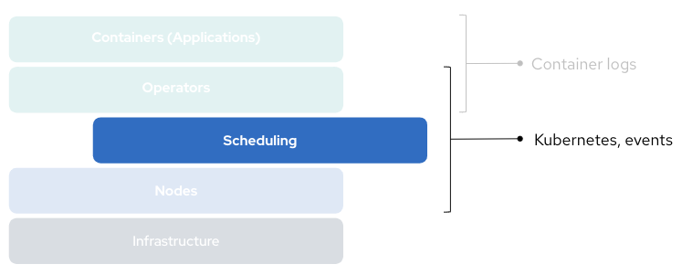
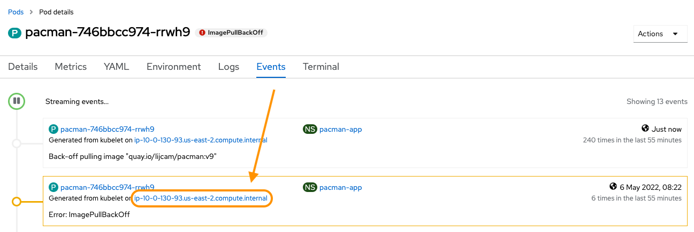
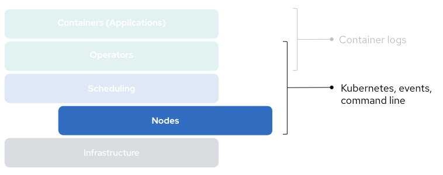
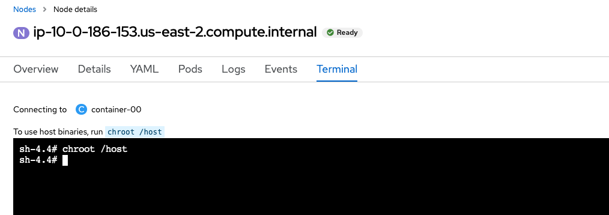
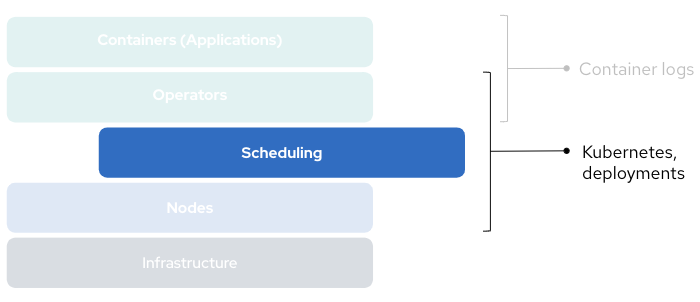
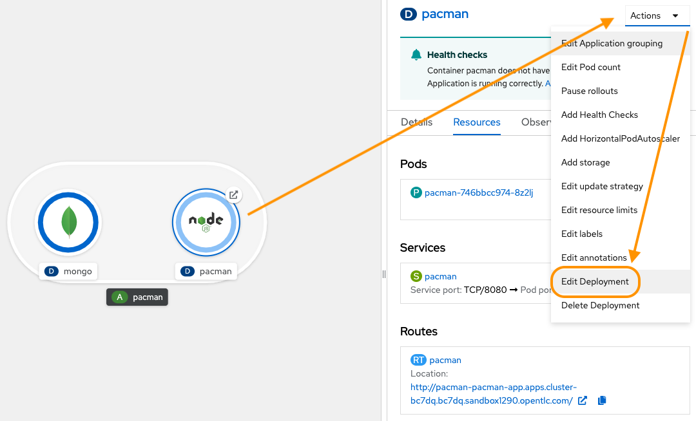
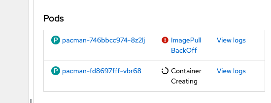

You’ve deployed the Pacman application to OpenShift, the database has started but, you notice the main application container is taking longer than usual to start.

<details><summary>If you're not already logged in, use these credentials.</summary>
<pre>
  username: admin
  password: admin
</pre>
</details>

From the Developer prespective, switch to the pacman-app project.

<details><summary>Command line</summary>
  <pre>oc project pacman-app</pre>
</details>



Click on the deployment to see the detailed view.

<details><summary>Command line</summary>
  <pre>oc get deployments
oc describe deployment/pacman</pre>
</details>

In our last exercise, the pod has a red ring signalling the pod had crashed. In this instance, our pod has never started. `ImagePullBackOff` signals that Kubernetes has been unsuccessful retrieving the container image, and is waiting to try again after a backoff period.



More information on pod error states can be found here — [Investigating pod issues](https://docs.openshift.com/container-platform/4.10/support/troubleshooting/investigating-pod-issues.html)

## Is there anything in the logs?


Applications running inside our containers produce logs. Without a running container, we have no logs.

<details><summary>Command line</summary>
  <pre>oc get pods
oc logs <em>pod_name</em></pre>
</details>



We need to start triaging the issue within Kubernetes.

## Click on the Events tab.



The Events tab surfaces activities occuring at the scheduling level, in the context of our project. Do you see `ImagePullBackOff` events?

<details><summary>Command line</summary>
  <pre>oc get events</pre>
</details>

The CRI-O container runtime retrieves images, and creates our containers. CRI-O runs on each node in the cluster.
In the event stream we can see which node Kubernetes attempted to schedule the pacman container.



## Click through to the node.

<details><summary>Command line</summary>
  <pre>oc get nodes
oc describe node/<em>node_name</em></pre>
</details>



Check the surface level metrics on the node. What is the status?
Check the Pods tab, do we have existing workload scheduled and running?

Everything to this point suggests the nod is healthy.

We can look at the raw logs from the CoreOS journal, are CRI-O errors visible there? Let’s jump onto the node to investigate further.

## Click the Terminal tab.

Opening the Terminal tab creates a debug pod on our node, if we want to access commands on the node itself, we need to `chroot` into the `/host` directory.


<details><summary>Command line</summary>
  <pre>oc debug node/<em>node_name</em></pre>
</details>

Now we can navigate like any other Linux system. On the node, we can use the `podman` and `crictl` commands to begin troubleshooting.

We can quickly confirm the `ImagePullBackOff` error by trying to manually pull down the image using `crictl`.

```
crictl pull quay.io/lijcam/pacman:v9
```
What happened when you tried to pull the image?

We can also check we have the correct image path with the `podman` command.

```
podman search --list-tags \
  quay.io/lijcam/pacman
```

Do you see a problem after running the `podman` command?

---

## Diagnosis
The pacman repository only has `v1` and `v2` tags. The deployment was trying to pull down a `v9` tag.

While we are on the node, let's confirm we can pull the `v2` tag.

```
crictl pull quay.io/lijcam/pacman:v2
```

---

## The fix
We need to modify our Deployment to use the correct image tag. Which will trigger our pods to reconcile.



Back to the topology screen and edit the Deployment.



<details><summary>Command line</summary>
  <pre>oc get deployments
oc edit deployment/pacman</pre>
</details>

Update the Image Name to point to the correct image path.
Does the container start?



<details><summary>Command line</summary>
  <pre>oc get pods --watch</pre>
</details>

---

## References

* [Investigating pod issues](https://docs.openshift.com/container-platform/4.10/support/troubleshooting/investigating-pod-issues.html)
