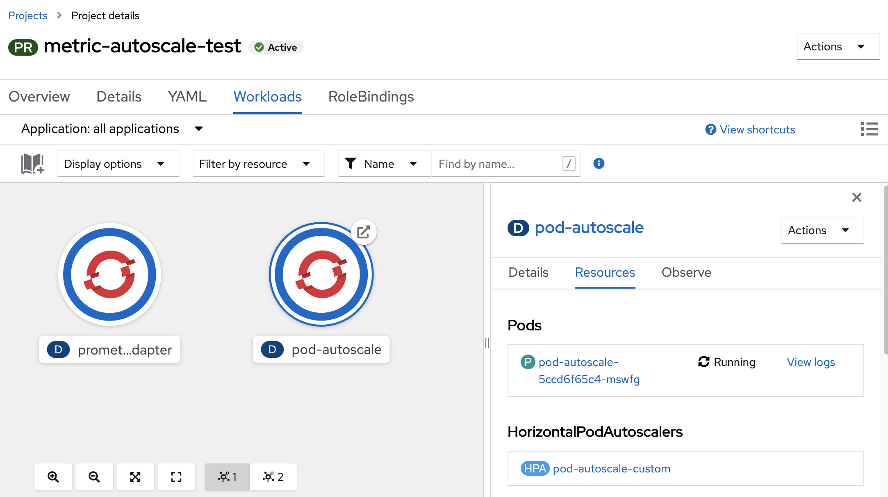
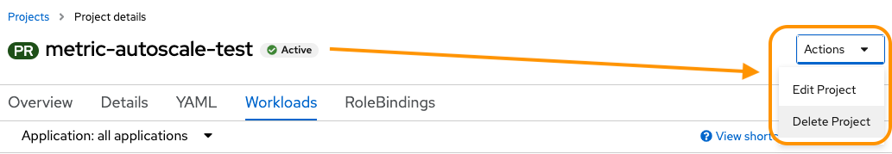
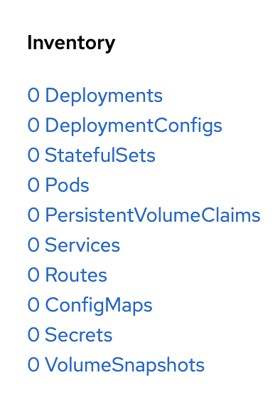

Your team has been experimenting with autoscaling options, and the latest round of tests has just finished.
In this exercise, we will work in the Administrator perspective, and command line.

<details><summary>If you're not already logged in, use these credentials.</summary>
<pre>
  username: admin
  password: admin
</pre>
</details>

## Enter the metric-autoscale-test project and click workloads



Take a look around at the resources in the deployment. What resources can you see here?

There are two deployments. A prometheus-adaptor and our pod-autoscale pod.
Click on the deployments and study them. What resources do they have?
The testing the team was doing was scaling a workload using a tech preview feature that exposes a horizontal pod scaler to custom metrics.

The prometheus-adaptor collects metrics from the pod-autoscale pod, so OpenShift monitoring can make decisions of when to scale the application.

Testing is complete, our task is the cleanup after the test runs. Conveniently, everything is in a single project. Let’s simply delete the project.



<details><summary>Command line</summary>
  <pre>oc delete project/metric-autoscale-test</pre>
</details>

Has the project deleted yet? Give it a minute.

<details><summary>Command line</summary>
  <pre>oc get project/metric-autoscale-test</pre>
</details>

Still no?

## Click on the project to see what’s happening

What components are remaining in the Inventory?



## Click on Events

We don’t have any events either. We’ll need to examine the issue in more depth on the command line.

```
oc describe project/metric-autoscale-test
```

There isn’t any more information than what we already know. You can use `get` to pull the current state in `yaml` form.

```
oc get -o yaml \
  project/metric-autoscale-test
```

We can observe in the metadata that our project object has a`.metadata.deletionTimestamp`. There is a finalizer waiting for related resources to be cleaned up before progressing the deletion of the project.
You can see the finalizer in the configuration `.spec.finalizers`

Scroll down a little further and read the conditions. Are there any clues to what the related object may be?

What is `custom.metrics.k8s.io/v1beta1` is it part of the Kubernetes API?
Lets see.

```
oc get APIServices
```

Does one look different to others?

Take a closer look at `v1beta1.custom.metrics.k8s.io`

```
oc get -o yaml APIService \
  v1beta1.custom.metrics.k8s.io
```

---

## Diagnosis

We can see the value `custom.metrics.k8s.io/v1beta1` on the `.metadata.name` matches the conditions on the project. The project is waiting for this to be deleted before finalising the cleanup.

We can see in the `.spec` that is custom metric that is depended on the deleted prometheus-adapter. Hence, the failed state of the resource.

---

## The fix

We need to delete the custom metric and wait a minute or two. After a few moments, Kubernetes will notice the change and clean up the project. Use the command line or check for the project using the console. We are looking for the command to return "not found".

```
oc delete APIService \
  v1beta1.custom.metrics.k8s.io
```

```
oc get project/metric-autoscale-test
```

```
Error from server (NotFound): namespaces "metric-autoscale-test" not found
```

---

## References

* This exercise used a tech preview feature that is deprecated in current versions of OpenShift. Do not consider it for production use-cases - [Exposing custom application metrics for autoscaling](https://docs.openshift.com/container-platform/4.7/monitoring/exposing-custom-application-metrics-for-autoscaling.html)
